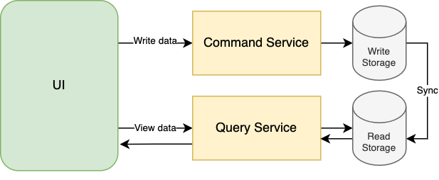
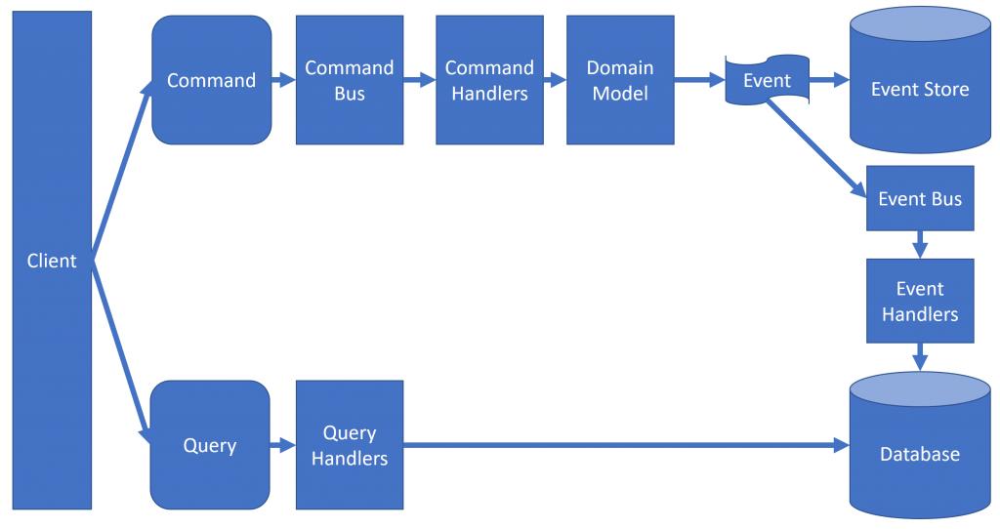
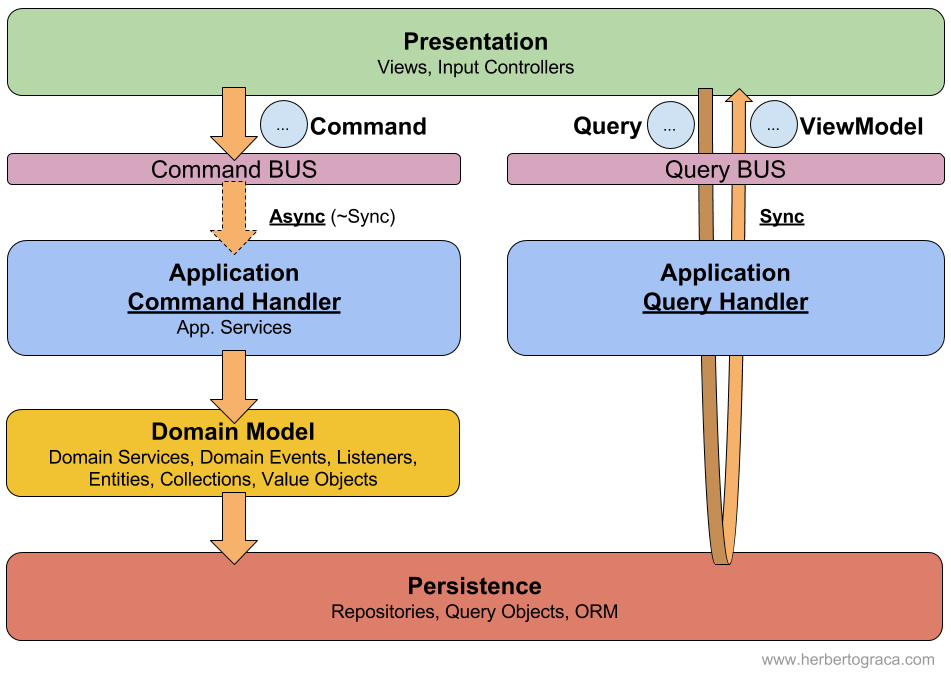

## Start
docker-compose up
 - Note: Is normal that ViewSynchronizer turn off when finished to fill view database.

## Description

This is a breakable toy with 4 different ways to implemented CQRS

1. Basic CQRS. The architecture is divided in queries and command with different repositories but with a common database.
That version is frequently eclipsed by cqrs with database sync. 
It hasn't any advantages in performance. 
But it allows complete flexibility to create queries, you don't need to obtain a big domain entity with 15 field.
You simply take the information that you need.
If you need an extra field you add it without problems, you'll never need again add a new field to domain entity just to draw in the view.

2. CQRS with synchronization to database. The architecture is separated in queries and command. Queries use mongodb database and command uses postgresql database. For synchronizes them, i use messages with rabbitmq like event bus.
That version keep the advantages of the basic version cqrs. And add an improvement in performance boost for that add complexity.  
 - Note: Think first if you need synchronization in real time. If you don't need, just throw the synchronizer view once each day to update the database. That reduces complexity. Now, you don't need to manage queue neither the errors what queue can generate.

3. CQRS where all command requests are received in a Command bus.
I implemented a simple event bus. That event bus works as a layer between command and controller.
That version keep the advantages of the basic version cqrs. Right now, is a memory event bus and just work like middleware between controllers and commands.
If you replace the memory bus by some async memory bus, you could prepare your commands to can horizontal scale. When cqrs has horizontal scalability, have several common points with microservices.

4. Orthodox CQRS. Use just one database, use command like dto, command bus, query bus, throw events.

## Start dev environment
docker-compose -f docker-compose-dev.yml -p development_CQRS_environment up -d
